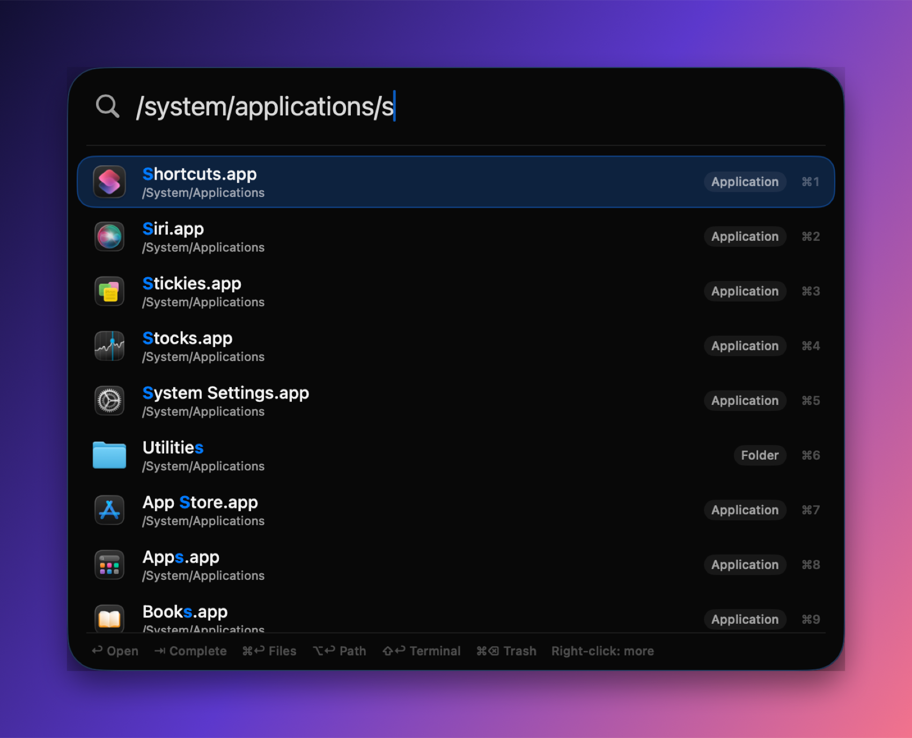
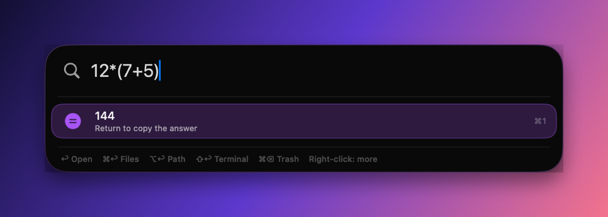
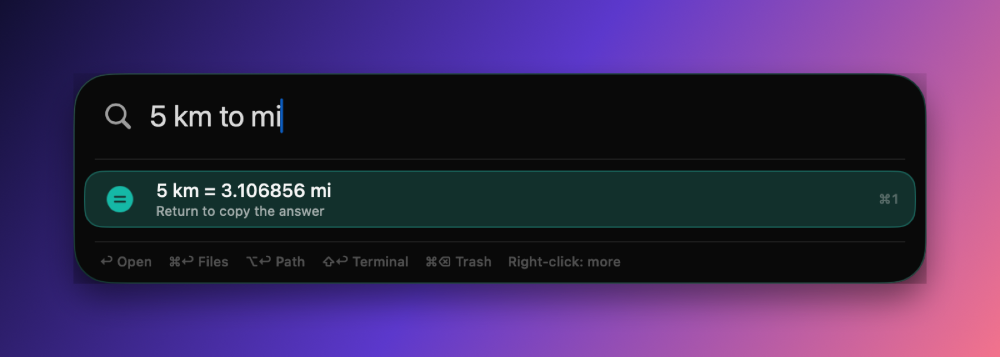
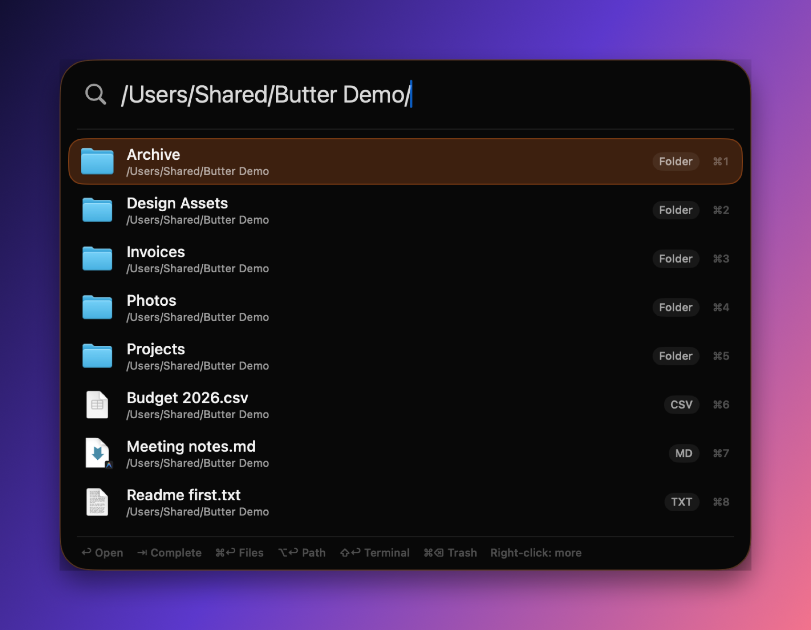
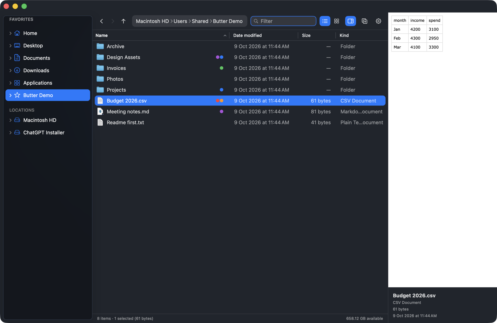
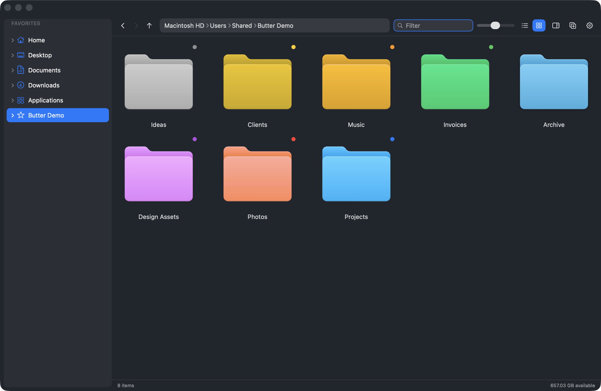
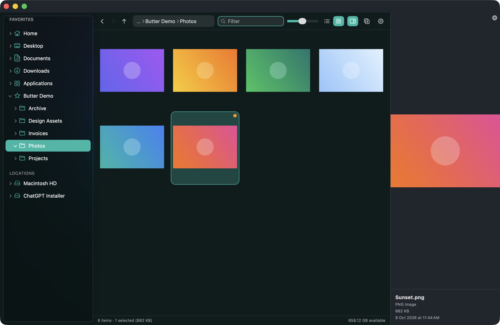
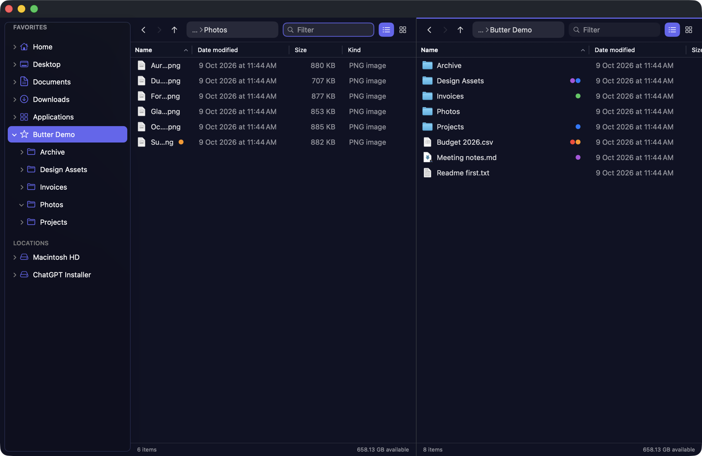
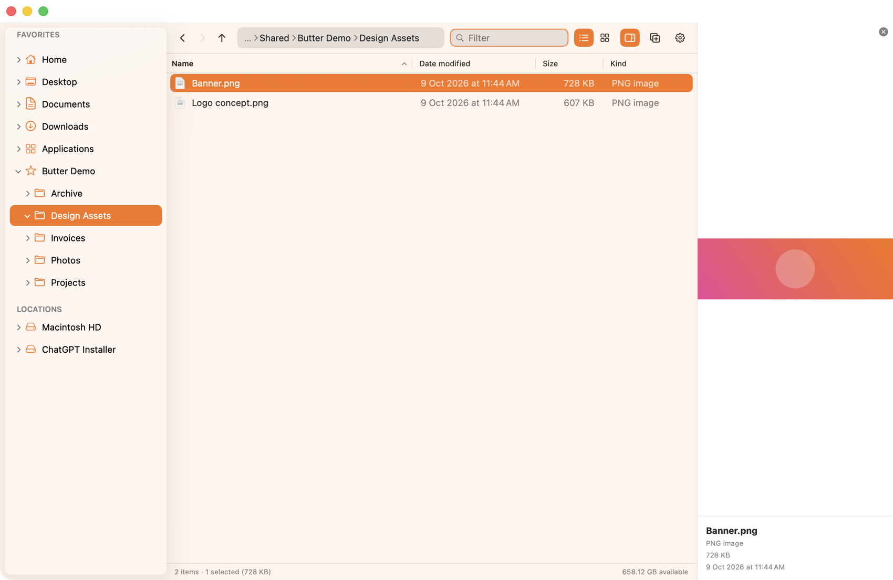
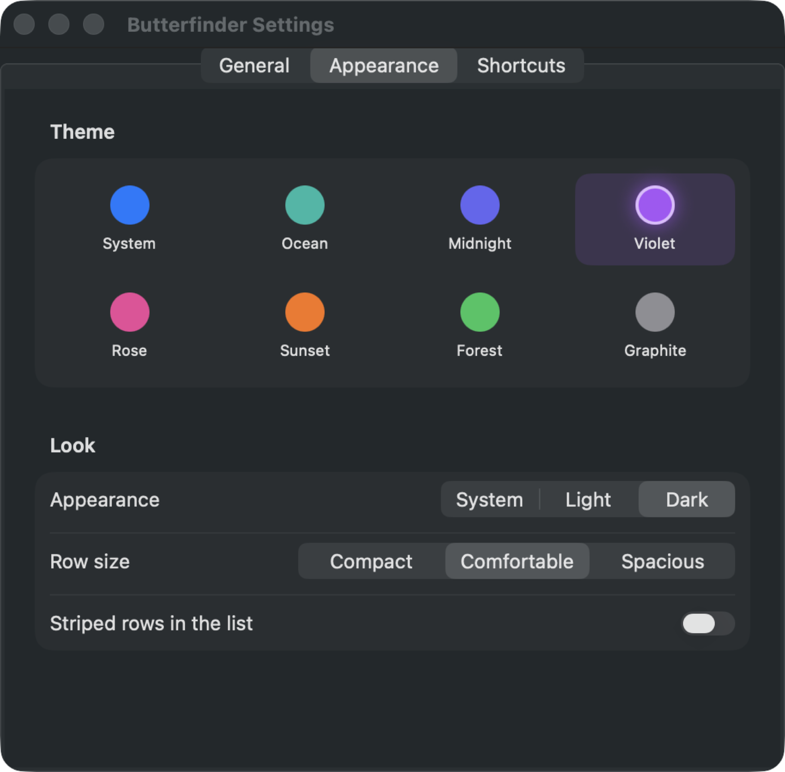

<div align="center">

# Butterlight &amp; Butterfinder

**A faster, friendlier Spotlight and Finder for macOS — one launcher, one file manager, built to feel like butter.**

  



</div>

---

## The two apps

| | **Butterlight** | **Butterfinder** |
|---|---|---|
| Replaces | Spotlight (`⌘ Space`) | Finder |
| What it is | A glass launcher that opens apps, files and folders instantly | A tabbed, dual-pane file manager with a live preview |
| Lives in | The menu bar | The Dock |

They talk to each other: open a folder from Butterlight and it appears in Butterfinder; press `⌘↩` on any result to see it in Butterfinder.

---

## Butterlight

Press **⌘ Space** and start typing.

<p align="center">
  
  
</p>

- **Browse like a terminal, search like Spotlight.** Type `/` or `~` to walk through folders. `/applications` lists every app, `/apps`, `/docs`, `/dl`, `/pics` jump straight to those folders, and typos like `/applicaiton` still work. **Tab** completes and steps into a folder.
- **Instant search.** Apps, files and folders, ranked by match quality and by what you actually open. Backed by its own index of your home folder, so there's no 300-result cap.
- **Calculator and unit conversion.** `12*(7+5)`, `2^10`, `5 km to mi`, `100c in f` — Return copies the answer.
- **Clipboard history.** Type `clip` to see what you copied recently (kept in memory only, and password-manager items are skipped).
- **Web search** when nothing matches.
- **Direct actions for addresses:** type an IP (`192.168.1.1:8080`), `localhost:3000` or `github.com/…` and press Return to open it in your browser.
- **Right-click any result** (with icons) for Open, Show in Butterfinder, Reveal in Finder, Open With, Copy Path, Copy Name, Open in Terminal, Remove from Recents and Move to Trash.
- **Keyboard first:** `⌘1`–`⌘9` open the first nine results, `⌥↩` copies the path, `⇧↩` opens Terminal, `⌘⌫` trashes.
- **Silky animations:** a highlight that glides between rows, blur-in on open, instant dismiss.

<p align="center">
  
</p>

---

## Butterfinder

<p align="center">
  
</p>

- **List and icon views** with real thumbnails and a smooth zoom slider.
- **Live preview pane** (Quick Look) for images, PDFs, video, text, code and more. **Space** opens full-size Quick Look.
- **Tabs** (`⌘T`) and **dual-pane** (`⌘\`) with `F5` copy / `F6` move to the other pane, or just drag between them.
- **Finder tags** with colored dots, and **tagged folders take their tag's color**. Right-click to tag, and filter with `#red`.
- **Compare two folders** (`⌥⌘K`): see what's only on one side and copy the missing files across. Nothing is ever overwritten or deleted.
- **Undo (`⌘Z`)** for move, rename, trash, paste, new folder, zip and bulk rename.
- **Never destructive:** delete goes to the Trash, and name clashes become `name 2.ext`.
- **Live updates:** files saved by other apps appear without a refresh; drives appear when plugged in.
- **Fast:** big copies, pastes and trashes run in the background.
- **Cut + Paste moves files** (Explorer-style), plus Duplicate, Make Alias, Compress/Extract, Get Info, Copy Path, Open Terminal Here, Reveal in Finder, Open With.
- **Bulk rename:** select several files and rename them `Trip 01, Trip 02, …` with a live preview.
- **Per-folder memory** for view, sort and zoom; choose your columns by right-clicking the header.
- **Favorites** in the sidebar, **Recent Folders**, and an address bar with breadcrumbs.

<p align="center">
  
</p>

<p align="center">
  
  
</p>

### Themes &amp; settings

Eight themes (System, Ocean, Midnight, Violet, Rose, Sunset, Forest, Graphite) in light or dark, plus row density, striped rows, hidden files, folder ordering, trash confirmation and more. Both apps have their own Settings (`⌘,`).

<p align="center">
  
  
</p>

---

## Install

### Download (easiest)

1. Grab **`Butterlight-Butterfinder-1.0.2.dmg`** from the [latest release](https://github.com/RandomKid24/betterfiles/releases/latest).
2. Drag **Butterlight** and **Butterfinder** into **Applications** and open them.
3. **The first launch will be blocked** — the apps aren't notarized by Apple yet. Either:
   - open **System Settings → Privacy &amp; Security**, scroll down and click **Open Anyway**, or
   - run this once in Terminal:
     ```bash
     xattr -dr com.apple.quarantine /Applications/Butterlight.app /Applications/Butterfinder.app
     ```
4. Turn off Spotlight's own shortcut so **⌘ Space** is free: **System Settings → Keyboard → Keyboard Shortcuts → Spotlight**.

Both apps offer to start at login (Butterfinder starts quietly in the background so folders open instantly).

Requires **macOS 26 (Tahoe) or later**. The build is universal: Apple Silicon and Intel.

### Build from source

You need Xcode with the macOS 26 SDK.

```bash
git clone https://github.com/RandomKid24/betterfiles.git
cd betterfiles
./package.sh          # builds and installs both apps into ~/Applications
./run.sh              # or: run the unpackaged dev builds in the background
./dist.sh 1.0.2       # builds a universal .dmg and .zip into dist/
swift test            # runs the unit tests
```

---

## Keyboard cheat sheet

**Butterlight**

| Key | Action |
|---|---|
| `⌘ Space` | Open / close |
| `↑` `↓` | Move through results |
| `↩` | Open |
| `⇥` | Complete a path |
| `⌘↩` | Show in Butterfinder |
| `⌥↩` | Copy path |
| `⇧↩` | Open in Terminal |
| `⌘⌫` | Move to Trash |
| `⌘1`–`⌘9` | Open that result |
| `Esc` | Dismiss |

**Butterfinder**

| Key | Action | Key | Action |
|---|---|---|---|
| `⌘T` / `⌘W` | New / close tab | `⌘\` | Split view |
| `⌘[` `⌘]` | Back / forward | `⌘↑` | Enclosing folder |
| `⌘L` | Address bar | `⌘F` | Filter |
| `Space` | Quick Look | `F2` | Rename |
| `⇧⌘N` | New folder | `⌘D` | Duplicate |
| `⌘Z` | Undo | `⌘I` | Get Info |
| `⇧⌘.` | Show hidden files | `⇧⌘P` | Preview pane |
| `F5` / `F6` | Copy / move to other pane | `⌥⌘K` | Compare panes |

---

## How it's built

Plain Swift Package Manager, no dependencies.

| Target | What |
|---|---|
| `Butterlight` | The launcher app (SwiftUI + AppKit) |
| `Butterfinder` | The file manager app |
| `LauncherCore` | Ranking, usage history, file index, calculator, path browsing (unit tested) |
| `FilesCore` | Folder listing, sorting, clipboard, file operations, undo, tags, compare (unit tested) |
| `Shared` | Themes and login-item helper |

## Roadmap

- [ ] Notarized releases (no Gatekeeper warning)
- [ ] Network drives and cloud folders
- [ ] Folder sync for files that differ (today it only copies missing files)
- [ ] Plugins / custom launcher commands

## Notes

- Hidden files are off by default. Turn them on with `⇧⌘.`.
- macOS doesn't let third-party apps become the default handler for folders, so folders you open from other apps still go to Finder. Butterlight opens them in Butterfinder.

## License

[MIT](LICENSE)

Made with care — and a lot of butter.
